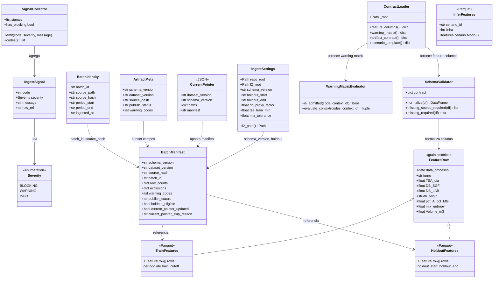
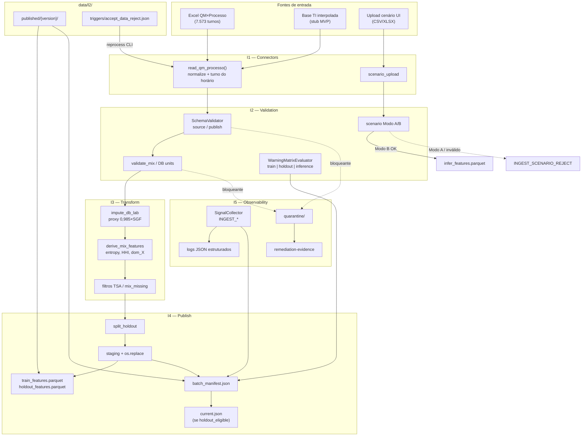

# Diagramas — Ingest Engine (Camada 2)

**Autor:** Emerson Antônio  
**Data:** 2026-07-10  
**Feature:** INGEST_ENGINE (shipped)

---

## 1. Diagrama de classes — estrutura de dados e componentes

Modelo lógico das entidades Python, contratos KB e artefatos L2 publicados.



### Grain e chaves

| Artefato | Chave primária | Descrição |
|----------|----------------|-----------|
| `train_features` | `data_processo` + `turno` | Treino até 2025-04-30 |
| `holdout_features` | `data_processo` + `turno` | Janela 2025-05-01 … 2025-10-30 |
| `infer_features` | `cenario_id` + `linha` | Upload cenário Modo B |
| `batch_manifest.json` | `dataset_version` | Metadados + rastreio |

### Flags de proveniência

| Coluna | Valores | Origem |
|--------|---------|--------|
| `db_origin` | `lab`, `proxy` | I3 imputation (`0,985 × DB_SGF`) |
| `publish_status` | `published_ok`, `published_with_warnings`, `quarantined` | I4 |

---

## 2. Diagrama de fluxo — pipeline batch e online



### Layout L2

```text
data/l2/
├── published/{dataset_version}/
│   ├── train_features.parquet
│   ├── holdout_features.parquet
│   └── batch_manifest.json
├── current.json              ← last-good (se holdout elegível)
├── current.json.previous
├── quarantine/{batch_id}/
├── triggers/
│   ├── accept_data_reject.json
│   └── processed/
└── remediation/
```

### CLI

```bash
ingest batch <arquivo.xlsx>
ingest scenario-validate <upload.csv> --cenario-id ID
ingest scenario-publish <upload.csv> --cenario-id ID
ingest reprocess
```
