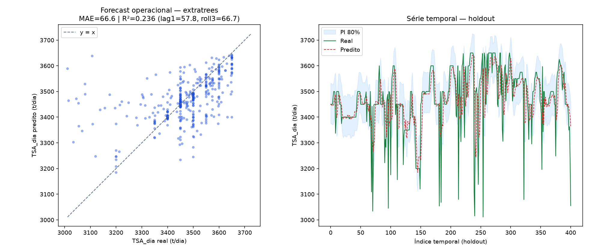

# Forecast Operacional TSA (Produto A)

**Autor:** Emerson Antônio
**Data:** 2026-07-13
**Base:** `base/primeira_base.csv` + lags temporais (2005 registros após lags)

## Estratégia

```
TSA_pred = TSA_roll3 + modelo_resíduo(features_processo + lags + FE)
```

## Baselines (holdout MAE)

| Baseline | MAE |
|----------|-----|
| mean | 119.47 |
| lag1 | 57.84 |
| roll3 | 66.67 |
| roll7 | 73.53 |

## Campeão: `extratrees`

**GridSearch:** `{'model__max_depth': 12, 'model__max_features': 'sqrt', 'model__min_samples_leaf': 10, 'model__n_estimators': 400}`

| Métrica holdout | Valor |
|-----------------|-------|
| MAE | 66.63 |
| RMSE | 106.83 |
| R² | 0.236 |
| Cobertura PI 80% | 71.3% |

## Gráfico



## Modelo

`/Users/emerson.antonio/Developar/keyrus/veracel/gifi-predict/models/primeira_base/forecast_2026-07-13T143544Z/forecast_extratrees.joblib`
