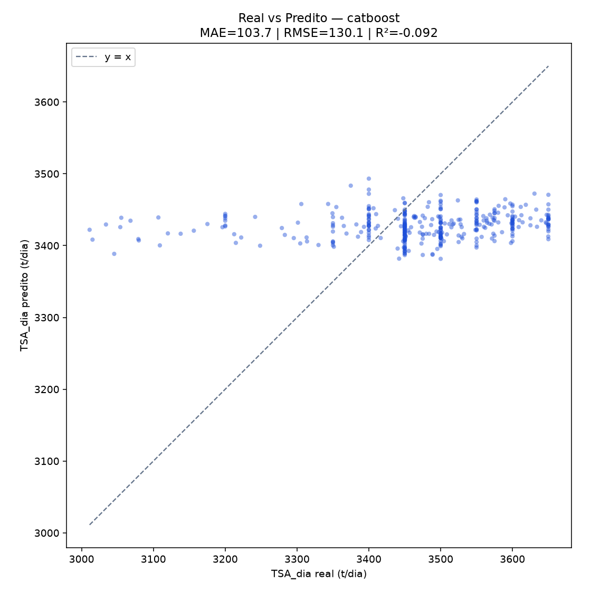

# Modelagem TSA — primeira_base

**Autor:** Emerson Antônio
**Data:** 2026-07-13
**Base:** `base/primeira_base.csv` (1902 registros, 100% completos)

## Definição

- **Y:** `TSA_dia`
- **X:** 17 features de negócio

## Validação

- CV: `TimeSeriesSplit` (5 folds) no pool de treino (80% inicial)
- Holdout: 20% final (ordem temporal 2021-06 → 2025-10)

## Ranking CV (MAE)

| Família | CV MAE |
|---------|--------|
| baseline | 101.25 |
| catboost | 101.86 |
| randomforest | 103.04 |
| extratrees | 103.75 |
| xgboost | 106.96 |
| histgradientboosting | 108.82 |
| elasticnet | 109.15 |
| ridge | 110.14 |
| lasso | 110.18 |
| lightgbm | 112.49 |

## Campeão: `catboost`

**GridSearch best_params:** `{'model__depth': 10, 'model__iterations': 200, 'model__l2_leaf_reg': 10.0, 'model__learning_rate': 0.03}`

**CV MAE (GridSearch):** 93.87

## Holdout temporal

| Métrica | Valor |
|---------|-------|
| MAE | 103.69 |
| RMSE | 130.14 |
| R² | -0.092 |

## Gráfico

## Artefato

`/Users/emerson.antonio/Developar/keyrus/veracel/gifi-predict/models/primeira_base/2026-07-13T102553Z/tsa_catboost.joblib`
